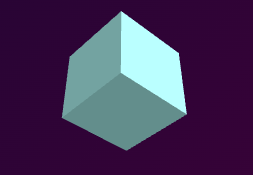

# Spinning Cube with Three.js

After getting comfortable with **HTML**, **CSS**, and **JavaScript**, I decided to dive into the world of **Three.js** — and it's been such a fun learning curve!

This project is my very first hands-on experiment with 3D in the browser: a simple but satisfying spinning cube. It might look small, but under the hood, it introduced me to how 3D scenes, cameras, and render loops work.

While most Three.js projects require a Node.js environment, NPM setup, and a local server (because Three.js is modular and doesn’t fully work through traditional CDNs), I discovered that simple experiments — like this spinning cube — can be created without any bundlers or CDN links.
By using native ES module imports directly in the browser, I was able to build and deploy this project with just plain HTML, CSS, and JavaScript — no extra setup needed.

 Live Preview
[Try it out here](https://prollypavani.github.io/3jsbasic/)

 What I Explored
- Creating a 3D scene with **Three.js**
- Using a **PerspectiveCamera** and setting up a **renderer**
- Making objects rotate with the animation loop
- Importing Three.js modules **without Node.js** (just native module scripts!)
- Keeping it light — no bundlers, no servers, just code

 Tech Stack
- HTML5
- CSS3 
- JavaScript (ES6 Modules)
- [Three.js](https://threejs.org/) (imported natively)

